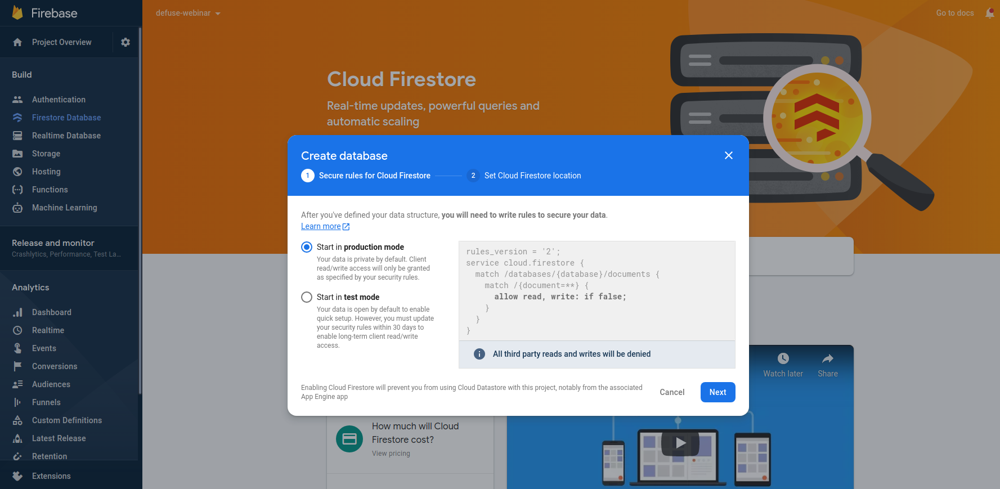
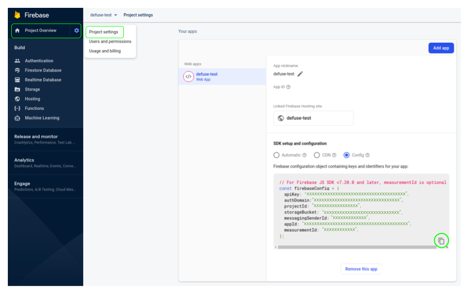

<p align="center" width="100%">
     
</p>

<h1 align="center">The commit annotator and model builder for defusing unsuspecting errors</h1>


Video demo: https://www.youtube.com/watch?v=yMKJkPABSLU

# How to set up

The application relies on Firebase's [*Firestore Database*]() and [*Storage*](). Therefore, the following steps are mandatory to set it up.

* **Step 1:** Clone the repository with `git clone https://github.com/radon-h2020/radon-defuse`.

* **Step 2:** [Create](https://firebase.google.com/docs/web/setup#create-firebase-project) a Firebase project. Give it a name of your choice.

* **Step 3:** Create a new Firestore database.




* **Step 4**: To initialize Firebase in your app, you need to provide your app's Firebase project configuration. You can [obtain your Firebase config object](https://support.google.com/firebase/answer/7015592) at any time.
Copy the Firebase configuration object containing keys and identifiers for your app in **defuse/src/environment<.prod>.ts**.




Here's the file **defuse/src/environment.ts** with example values:

```typescript
export const environment = {
    production: false,
    firebase: {
        apiKey: "AIzaSyDOCAbC123dEf456GhI789jKl01-MnO",
        authDomain: "myapp-project-123.firebaseapp.com",
        databaseURL: "https://myapp-project-123.firebaseio.com",
        projectId: "myapp-project-123",
        storageBucket: "myapp-project-123.appspot.com",
        messagingSenderId: "65211879809",
        appId: "1:65211879909:web:3ae38ef1cdcb2e01fe5f0c",
        measurementId: "G-8GSGZQ44ST"
    }
};
```

**Note**: it is recommended to use different configuration objects for development (**defuse/src/environment.ts**) and production (**defuse/src/environment.prod.ts**) environments.

* **Step 5**: To use *Firebase Storage*, you need to [generate](https://firebase.google.com/docs/admin/setup?authuser=0#initialize-sdk) a private key file for your Firebase service account:
    - In the Firebase console, open **Settings > Service Accounts**.
    - Click **Generate New Private Key**, then confirm by clicking **Generate Key**.
    - Rename the JSON file containing the key as `.key.json` and copy it the folder **backend**.

* **Step 6**: To build the application ensure **docker-compose** is installed on your machine, then run `docker-compose build` in the repository root folder.


## How to run

In the repository root folder run `docker-compose up`.
The application runs on `http://localhost:4200/`.


